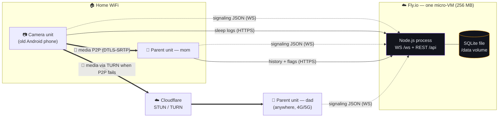
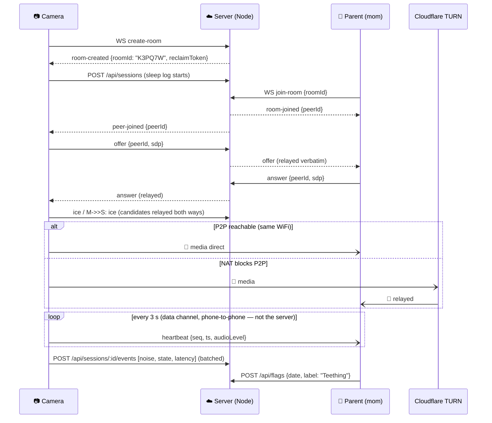
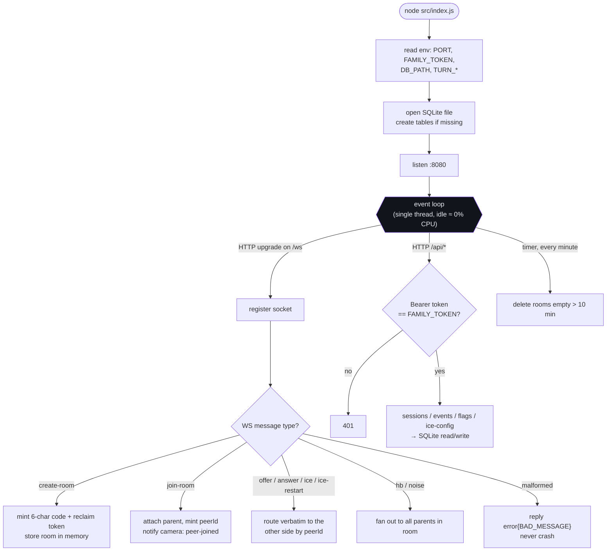

# ADR-0001: Backend stack — Node.js + embedded SQLite on Fly.io

| | |
|---|---|
| **Status** | Accepted (2026-07-17) · Java reference implementation added 2026-07-18 (`server-java/`) |
| **Deciders** | Nichlas (owner) · Claude (implementation) |
| **Scope** | The single backend process: WebRTC signaling relay + sleep-history REST API + storage |

---

## Part 1 — Technology primer (read this first)

You know Java. Here is every technology in this decision, what it *is*, and its
closest Java-world equivalent.

### Node.js — "the JVM for JavaScript"

| | Java world | This project |
|---|---|---|
| Runtime executable | `java.exe` runs bytecode on the JVM | `node.exe` runs JavaScript files directly |
| A program | `.java` → compiled `.jar` | `.js` / `.mjs` files — **no compile step**, the source *is* the program |
| Run command | `java -jar server.jar` | `node src/index.js` |
| Standard library | JDK (`java.net`, `java.sql`…) | Node built-ins (`node:http`, `node:sqlite`…) |
| Dependencies | Maven Central + `pom.xml` | npm registry + `package.json` |

The big architectural difference is the **threading model**:

- **Java (classic)**: one thread per request/connection. 5 WebSockets = 5 threads
  parked on I/O, each holding ~1 MB stack. Frameworks manage pools for you.
- **Node**: **one single thread** running an *event loop*. It never waits on I/O —
  it registers a callback ("when a message arrives on socket 3, run this function")
  and moves on. For a server that mostly *waits* (ours!), one thread handles
  thousands of idle connections in ~50 MB total.

Neither model is "better" — Node's is simply a perfect shape for *this* workload:
hold a few mostly-silent WebSockets, occasionally forward a small JSON message.
There is no CPU work worth parallelizing.

> `.mjs` vs `.js`: same language; `.mjs` just marks the modern **m**odule syntax
> (`import`/`export`, like Java's `import`) instead of the legacy `require()` style.

### WebSocket — a phone line instead of letters

Normal HTTP is request→response→goodbye (like sending a letter and getting a reply).
A **WebSocket** starts as an HTTP request that then *upgrades* into a permanent,
two-way TCP connection — a phone line held open. Either side can push a message at
any time with ~zero overhead. Java equivalent: `jakarta.websocket` / Spring's
`WebSocketHandler`. We need this because when mom's phone joins, the *server* must
push "peer-joined" to the camera immediately — the camera can't be asked to poll.

### WebRTC + STUN + TURN — why phones can stream without our server

- **WebRTC** is the browser/phone standard for real-time audio/video. Two devices
  negotiate a direct encrypted media connection (DTLS-SRTP). The negotiation
  messages (called SDP offers/answers and ICE candidates) must be carried between
  the devices by *something* — that something is our signaling server. After the
  handshake, media flows **device-to-device**; the signaling server could crash and
  the stream would keep playing.
- **STUN** ("what's my public address?") — a tiny free service that lets a phone
  behind a home router discover its public IP so the other phone can reach it
  directly. Think of it as a mirror, not a relay.
- **TURN** — when both sides are behind hostile NATs and no direct path exists,
  media is relayed through a TURN server. This is the only piece that carries real
  bandwidth, which is why we use **Cloudflare's** free tier instead of hosting it —
  relaying video is exactly the workload you don't want to pay a VPS for.

### SQLite — a database as a library, not a service

PostgreSQL/MySQL (and most Java setups) run a **database server**: a second process
you deploy, secure, connect to over TCP, and pay for. **SQLite** is instead a
*library inside your process* that reads/writes **one file on disk**. Java
equivalent: H2/HSQLDB in embedded mode — except SQLite is the most deployed database
on Earth (every phone, every browser).

When it's right: one process, one machine, moderate write volume → us, exactly.
When it's wrong: many app instances on different machines writing concurrently —
a scaling problem this system is *designed never to have* (one family, one server).

Bonus: since Node 22, the SQLite driver ships **inside the Node runtime**
(`node:sqlite`) — nothing to install, nothing to compile.

### Docker + Fly.io — how it gets hosted

- **Docker**: packages the app + runtime + OS libs into an image that runs
  identically anywhere (Java analogy: a fat-jar, but for the whole OS environment).
  Our `server/Dockerfile` is 6 lines.
- **Fly.io**: a hosting service (like Heroku's successor) that takes a Dockerfile
  and runs it as a micro-VM near your users, with a **persistent volume** (a disk
  that survives restarts — our SQLite file lives there), free TLS certificates, and
  first-class WebSocket support. The free tier gives small 256 MB VMs — enough for
  Node (~50 MB), tight for a JVM (~150–300 MB idle).
- Deployment is literally: `fly deploy`. That's the whole pipeline.

### The one npm dependency: `ws`

Node's standard library speaks HTTP but not the WebSocket protocol upgrade; `ws` is
the de-facto standard library for that (think: the Netty of the Node world, but
single-purpose). Everything else — HTTP routing, JSON, SQLite, crypto/UUIDs — is
built into the runtime.

---

## Part 2 — Context

The baby monitor (spec.md, docs/SPEC-ADDENDUM.md) needs exactly **one** server-side
component, with deliberately tiny duties:

1. **Signaling** (TR2): relay the WebRTC handshake JSON between phones. After the
   handshake, media never touches this server (see primer above).
2. **Sleep history** (F9/F10): store sessions + events (noise, freezes, reconnects)
   and parent-added date flags ("Teething", "Sick"); serve them back to both phones.

Constraints that shaped the decision:

- **NTR4/NTR2**: no accounts, no media stored — a shared family token suffices.
- **NTR5**: signaling must be swappable later (LiveKit/100ms) without app changes →
  the wire contract lives in `docs/PROTOCOL.md`, independent of server language.
- **Cost**: personal project → free/near-free. One family → one instance. Scaling
  is a non-goal.
- **Ops**: one person maintains this at 3 AM. Fewer moving parts wins.
- spec.md TR1 explicitly names Node.js + WebSocket as the intended stack.

## Part 3 — Decision

**One Node.js 24 process** (plain JavaScript) serving WebSocket signaling and REST
from the same port, with **SQLite embedded in-process**, deployed as **one Fly.io
micro-VM** with a persistent volume. Single npm dependency: `ws`.

The three fit together because the whole design is *"one small machine, one
process, one file"*:

| Piece | What it contributes | Why the others make it work |
|---|---|---|
| Node.js | Handles all connections in one thread at ~50 MB RAM | …which is what lets everything fit in Fly's free 256 MB VM |
| SQLite | Storage with zero extra services — the DB is a file | …safe because Node runs as exactly one process (no concurrent writers), and the file sits on Fly's persistent volume |
| Fly.io | Free hosting, TLS, WebSockets, persistent disk, `fly deploy` | …viable because Node+SQLite need so little: no DB server to host, no memory headroom to buy |

## Part 4 — Options considered

### A. Node.js + `node:sqlite` + Fly.io ✅ chosen

| Pros | Cons |
|---|---|
| Matches the spec (TR1) | JavaScript is unfamiliar to the owner |
| ~50 MB RAM → free tier fits | Dynamic typing: wire-format mistakes surface at runtime, not compile time |
| 1 dependency, no compile step, no native builds | *(both mitigated by the pinned contract in PROTOCOL.md + 31 behavioural tests)* |
| `ws` is battle-tested; JSON is native to the language | |
| ~400 lines total — small enough to read in one sitting | |

### B. Java 17 + Javalin + sqlite-jdbc

| Pros | Cons |
|---|---|
| **Owner's primary language** — long-term maintainability by the person who matters | JVM idles at ~150–300 MB → needs a paid 512 MB VM (~$3–5/mo) or GraalVM native-image (adds build complexity) |
| Compile-time type safety on the wire models | More boilerplate for the same behaviour |
| Same architecture works 1:1 (Javalin ≈ embedded Jetty: WS + REST in one process; sqlite-jdbc = same file DB) | Second toolchain (JDK/Gradle) in the repo |

**Verdict:** a full reference port lives in `server-java/` — same PROTOCOL.md
contract, so it's a drop-in replacement whenever familiarity outweighs the ~$4/mo.
Nothing in the app would notice the swap.

### C. Dart (`shelf`) — same language as the Flutter app

Pros: one language repo-wide. Cons: weakest server/WebSocket ecosystem of the
three; no built-in SQLite; the shared-model benefit is tiny (the models are ~100
lines). **Rejected.**

### D. Managed signaling service (LiveKit Cloud / 100ms)

Pros: zero server code; recording/multi-feed built in. Cons: overkill for v0.1,
monthly cost, vendor lock-in, and we'd *still* need somewhere to host the sleep-log
REST API. **Deferred** — NTR5 keeps this door open by design.

### E. Any of the above + hosted PostgreSQL

Pros: "real" database, multi-instance ready. Cons: a second service to run, secure
and pay for — solving a scaling problem this system is designed never to have.
**Rejected.**

## Part 5 — Consequences

- ✅ Free hosting; `fly deploy` is the whole release process; backup = copy one file.
- ✅ App is language-agnostic toward the server (PROTOCOL.md) — proven by
  `server-java/` passing the same behavioural contract.
- ⚠️ JavaScript maintenance falls to the owner — mitigated by ~400 LoC, no
  framework, 31 tests, and the Java escape hatch.
- ⚠️ Single instance = single point of failure. Accepted: established streams keep
  playing without the server; only *new* pairings and log sync pause (the app's
  offline queue drains later — NTR3).
- ⚠️ Fly free tier may suspend an idle VM (cold start ≈ seconds on next pairing).

## Part 6 — Diagrams

### Landscape — who talks to whom

*Dashed = control plane (tiny JSON, our server). Bold = media plane — never touches
our server.*

### Sequence — pairing, streaming, logging

### Process — inside the Node event loop

## Related

- `docs/PROTOCOL.md` — the language-neutral wire contract both implementations obey
- `server/` — chosen implementation (Node.js) · `server-java/` — Java reference port
- spec.md TR1/TR2/NTR3/NTR4/NTR5 — requirements this decision satisfies
